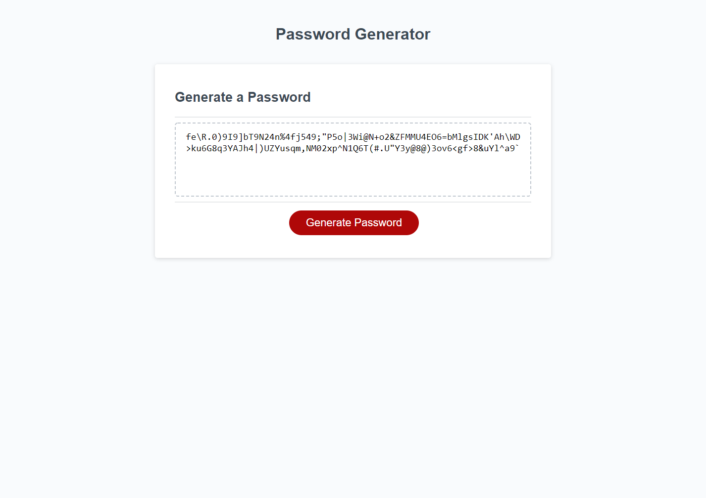

## Password-Generator

# Table of Contents
1. [Description](#description)
2. [Visuals](#visuals)

# Description
This project is a password generator made by Jacob Lockhart. The website prompts the user with amount of characters they want that can be between 8 and 128 characters, as well as checking if the number that they stated is a number. It then asks for a series of types of characters to use and then generates the password in the middle.

[Link to Live Site](https://revilite.github.io/Password-Generator/)

# Visuals

